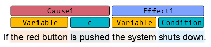

# Label Visualization

This repository contains the prototype of a React component for label visualization. 

## Use Case

In certain use cases, a natural language sentence contains labels, where each label spans one or more consecutive words and has a clear identity (i.e., a label type). For example, in the [CiRA project](www.cira.bth.se), the causal elements of a natural language sentence (e.g., the `cause` or `effect` portion of a sentence) are automatically annotated as shown.

To visualize these labels, annotation tools like [brat](https://brat.nlplab.org/) had been used. However, this technology is fully based on jQuery and its integration into a modern, React-like web interface is not without difficulty. Hence, this project represents a reimplementation of the `brat` functionality in a React-ive way.