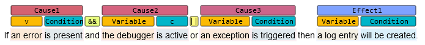
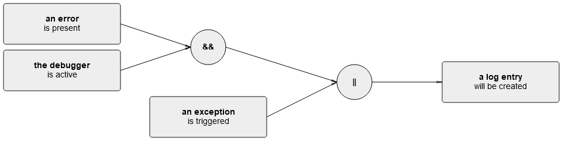

# CiRA Visualization

This repository contains the prototype of a React component for the visualization of the output from the CiRA (Causality in Requirements Artifacts) pipeline.

## Use Case

Causal sentences in natural language requirements specifications embed critical information about the relationship implied by that requirement. Extracting these causal relationships is the goal of the CiRA (Causality in Requirements Artifacts) initiative (see the [CiRA project](www.cira.bth.se)) and contains two intermediate artifacts:

1. **Labels**: A list of labels that make the role of each token in the causal relationship explicit.
2. **Cause-effect Graph**: An acyclic graph representing the causl relationship in the form of events.

This repository provides the means to visualize these two intermediate artifacts.

### Labels

A label consists of a *label type* as well as a *begin* and *end* index within a sentence. The label types are [explicitly defined](./vizdemo/src/packages/labelvisualization/util/labeltypes.js) and consists of a name, short name, description, color, and level. In the CiRA context, there are two levels of labels:

1. Level 1: **Event labels** identify to which *event* the labeled part of the sentence belongs (e.g., *cause 1* or *effect 3*).
2. Level 0: **Sub-labels** identify which *role* the labeled part of the sentence fulfills within its event (e.g., *variable* or *condition*), and **junctors** identify how events are connected to each other (e.g., *conjunction* or *disjunction*).

The following image visualizes a causal sentences and the according labels:

### Cause-Effect Graph

A cause-effect graph consists of nodes and edges. There are two types of nodes:

1. **Event nodes** represent events and consists of a variable and a condition.
2. **Intermediate nodes** represent junctors and connect two or more incoming edges with one outgoing edges.

Edges represent causal influence. The following image visualizes the cause-effect graph of the previous sentence:

## Usage

The code of this repository is meant to be used by [embedding it into another project](#use-in-another-project) to visualize the intermediate CiRA artifacts. However, this repository also contains a [demo](#demonstration) for illustration purposes.

### Use in another project

To use the label visualization in another project, perform the following steps:

1. Copy the [labelvisualization](./vizdemo/src/packages/labelvisualization/) folder into your project.
2. Adjust the [labeltypes](./vizdemo/src/packages/labelvisualization/util/labeltypes.js) component. Every label type should contain a `label`, `short` (short version of the `label` name), `color` (as hex value), and `level` value.
3. Create a `LabelVisualizer` component, providing both a `text` as well as a list of `labels` (containing a `type` that corresponds to the `label` names as well as a `begin` and `end` property representing its starting and ending character within the text.)

To use the cause-effect graph visualization in another project, perform the following steps:

1. Copy the [graphvisualization](./vizdemo/src/packages/graphvisualization/) folder into your project.
2. Adjust the [configuration](./vizdemo/src/packages/graphvisualization/util/cegconfig.js) to adjust the layout of the graph.
3. Create a `CEGVisualizer` component, providing a cause-effect graph object (following the structure as demonstrated in the [mocked cause-effect graph](./vizdemo/src/util/sentences/s6/ceg.js)).

### Demonstration

To run a demo of the visualization, run `npm run start` from the [vizdemo](./vizdemo/) folder. It uses the [labeltypes](./vizdemo/src/packages/labelvisualization/util/labeltypes.js) from the CiRA project and renders some [mocked labels](./vizdemo/src/util/mocklabels.js) on top of a sentence.

## Credit

The visualization of the causal labels in inspired by [brat](https://brat.nlplab.org/) and the visualization of the cause-effect graphs is inspired by [mxgraph](https://jgraph.github.io/mxgraph/).